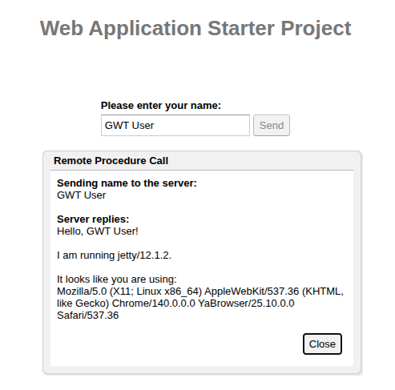

# RPC связь GWT клиента и GWT сервера

При использовании GWT-RPC не нужно кодировать и декодировать объект на каждом конце, можно просто передать обычный объект Java клиенту и использовать его там.

### Установка
java 17
````shell
export JAVA_HOME=/usr/lib/jvm/java-17-openjdk-amd64/
````

### Сборка
````shell
./mvnw clean package
````

### Запуск
1. В одном окне запустить CodeServer (./run1_codeserver.sh):

````shell
export JAVA_HOME=/usr/lib/jvm/java-17-openjdk-amd64/
./mvnw gwt:codeserver -pl *-client -am
````

2. В другом окне запустить приложение (./run2_jetty.sh):

````shell
./mvnw jetty:run -pl *-server -am -Denv=dev
````

Открыть [http://127.0.0.1:8080/](http://127.0.0.1:8080/)



### Замечания

1. Проект [многомодульный](https://v.perm.ru/index.php/component/content/article/multi-module-project?catid=15&Itemid=101)
./pom.xml

````xml
...
  <modules>
    <module>gwt_use_simple-client</module>
    <module>gwt_use_simple-shared</module>
    <module>gwt_use_simple-server</module>
  </modules>
...
````

В __gwt_use_simple_shared__ описание интерфейсов и общих классов.
RPC сервис GreetingService описывается интерфейсом GreetingService из __shared__ и имплементацией 
в модуле __gwt_use_simple-server__ (extends com.google.gwt.user.server.rpc.jakarta.RemoteServiceServlet).
В pom.xml клиента __gwt_use_simple-client__ импортируется так:
````xml
  <parent>
    <groupId>ru.perm.v</groupId>
    <artifactId>gwt_use_simple</artifactId>
    <version>1.0-SNAPSHOT</version>
  </parent>
  <artifactId>gwt_use_simple-client</artifactId>
...
    <dependency>
      <groupId>${project.groupId}</groupId>
      <artifactId>gwt_use_simple-shared</artifactId>
      <version>${project.version}</version>
    </dependency>
    <dependency>
      <groupId>${project.groupId}</groupId>
      <artifactId>gwt_use_simple-shared</artifactId>
      <version>${project.version}</version>
      <classifier>sources</classifier>
    </dependency>
...
````

Отправка запроса на сервер и получение ответа __gwt_use_simple-client/.../App.java__:

````shell
      class MyHandler implements ClickHandler, KeyUpHandler {
            ...
			/**
			 * Send the name from the nameField to the server and wait for a response.
			 */
			private void sendNameToServer() {
				// First, we validate the input.
				errorLabel.setText("");
				String textToServer = nameField.getText();
				if (!FieldVerifier.isValidName(textToServer)) {
					errorLabel.setText("Please enter at least four characters");
					return;
				}

                ...
				// Then, we send the input to the server.
				greetingService.greetServer(textToServer,
						new AsyncCallback<GreetingResponse>() {
							public void onFailure(Throwable caught) {
								// Show the RPC error message to the user
								dialogBox
										.setText("Remote Procedure Call - Failure");
								serverResponseLabel
										.addStyleName("serverResponseLabelError");
								serverResponseLabel.setHTML(SERVER_ERROR);
								dialogBox.center();
								closeButton.setFocus(true);
							}

							public void onSuccess(GreetingResponse result) {
								dialogBox.setText("Remote Procedure Call");
								serverResponseLabel
										.removeStyleName("serverResponseLabelError");
								serverResponseLabel.setHTML(new SafeHtmlBuilder()
										.appendEscaped(result.getGreeting())
										.appendHtmlConstant("<br><br>I am running ")
										.appendEscaped(result.getServerInfo())
										.appendHtmlConstant(".<br><br>It looks like you are using:<br>")
										.appendEscaped(result.getUserAgent())
										.toSafeHtml());
								dialogBox.center();
								closeButton.setFocus(true);
							}
						});
			}
		} 
		...
      MyHandler handler = new MyHandler();
	  sendButton.addClickHandler(handler);
	  ....
}
````